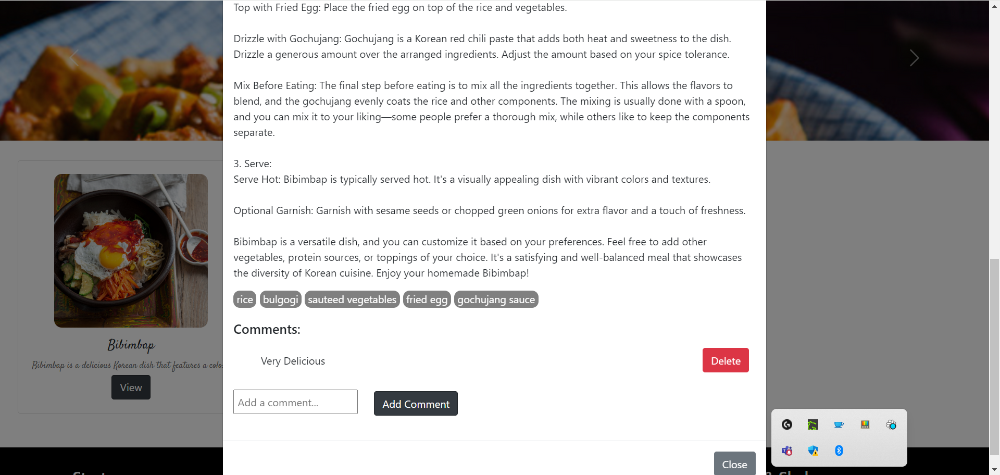

# Project Name: reSSSiPes
 - This web application is created for educational purpose for the below mentioned course taken by the below authors in the term Fall 2023.

- Course Name: INFO6150 Web Design and User Experience Engineering (12891)

 - Taught by: Professor Vishal Chawla

 - Author: Hitesh Soneta, Omkumar Solanki, Vishvesh Panchal, Vrishab Shetty 

 - Univeristy: Northeastern Univeristy, Boston

 - Program: MS Software Engineering Systems

Final Project Submission

Project Name: reSSSiPes 

## INTRODUCTION:

Step into a world of culinary delight with reSSSiPes —a hub where the joy of cooking comes to life. Our responsive platform is dedicated to delivering a plethora of delectable recipes, each accompanied by step-by-step guides to make your cooking experience seamless and enjoyable

Embark on a gastronomic journey as talented contributors showcase their mouthwatering creations. Discover an array of recipes spanning various cuisines, from the comfort of your home kitchen. Easily navigate through the platform to find the perfect dish for any occasion.

Engage in the art of cooking like never before. Follow recipes, explore cooking techniques, and share your culinary creations with a community of like-minded enthusiasts. Leave comments, exchange tips, and immerse yourself in a shared culinary experience that goes beyond the traditional cookbook.
Our mission is to inspire and empower you in the kitchen. Whether you're a seasoned chef or a kitchen novice, our platform is designed to make the world of cooking accessible, interactive, and, above all, delicious. Join us in celebrating the joy of cooking, one recipe at a time!"

## ROLES:

1. Admins: 
- Admins have a comprehensive overview of the hub, allowing them to monitor all activities.
- They can view and manage recipes posted by chefs, including dishes, comments, and user feedback. 
- Admins have the authority to delete comments on recipes, edit, and delete recipes from all chefs.

2. Chefs: 
- Chefs are the heart of the hub, creating and sharing delectable recipes with the community. 
- They can craft new recipes, providing details such as the recipe name, a description of the steps, and images of the dish. 
- Chefs have the ability to engage with users by viewing comments and receiving feedback. 
- The platform encourages collaboration among chefs, allowing them to follow and be followed by their culinary peers.

3. Users: 
 - Users have a personalized experience, with the home page featuring curated recipes from the chefs they follow.
 - They can explore a vast collection of recipes, even from chefs they don't follow, and search for specific recipes or chefs by name.
 - Users can actively engage by commenting on recipes, sharing their reviews, and seeing what others have to say. - The platform values user feedback, providing a space for users to share their experiences, rate recipes, and offer suggestions for improvement.

# FrontEnd

## Register

## Login 

## Home Page
Based on the user's role, Home Page will have different accessibility of the pages
### Admin

### User

### Chef

## Chefs Page

## Feedback Page

Only Chefs and normal Users can submit a feedback form. And Admin can view all the submitted feedbacks.

### Form

### Feedbacks

## Search
Search query works on whole database. It will retrive all matched data(i.e Recipes and Chefs).

### Recipes

### Chef

## Edit User Page

### User

### Chef

## Recipe Modal

### View
Displays image of the Recipe, Recipe description, Ingredients and Comments.

### Add Comment
Only creator of the comment can delete their comment. And Admin has accesss to delete any comment.

## Create Recipe

## Common Functionality:
- 	1.	Edit Profile:
- 	All participants, whether admins, chefs, or users, have the ability to edit their profiles, ensuring a personalized and up-to-date presence on the platform.

# Backend

## How to run:

If you want to run manually
-	Open Backend in the terminal 
-	Run the command “npm i”
-	Wait for the node to install all the dependencies.
-	Run the command “npm start” to start the backend (For dev Server "npm run devStart").
-	Backend will start on port 3001.

- Open Frontend/my-app in the terminal 
-	Run the command “npm i”
-	wait for node to install all the dependencies
-	Run the command “npm start” to start the frontend.
-	Frontend will start on port 3000

## Backend dependencies:

Dependencies:
-	bcrypt: ^5.1.1
-	body-parser: ^1.20.2
- 	cors: ^2.8.5
- 	ejs: ^3.1.9
- 	express: ^4.18.2
- 	express-flash: ^0.0.2
- 	express-session: ^1.17.3
- 	method-override: ^3.0.0
- 	mongodb: ^6.3.0
- 	mongoose: ^8.0.2
- 	multer: ^1.4.5-lts.1
- 	passport: ^0.6.0
- 	passport-local: ^1.0.0

DevDependencies:
- 	dotenv: ^16.3.1
- 	nodemon: ^3.0.1

Front dependencies:

## Dependencies:
- 	@popperjs/core: ^2.11.8
- 	@testing-library/jest-dom: ^5.17.0
- 	@testing-library/react: ^13.4.0
- 	@testing-library/user-event: ^13.5.0
- 	axios: ^1.6.2
- 	react: ^18.2.0
- 	react-bootstrap: ^2.9.1
- 	react-dom: ^18.2.0
- 	react-router-dom: ^6.20.0
- 	react-scripts: 5.0.1
- 	react-tag-input: ^6.8.1
- 	web-vitals: ^2.1.4

